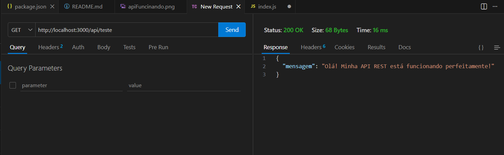
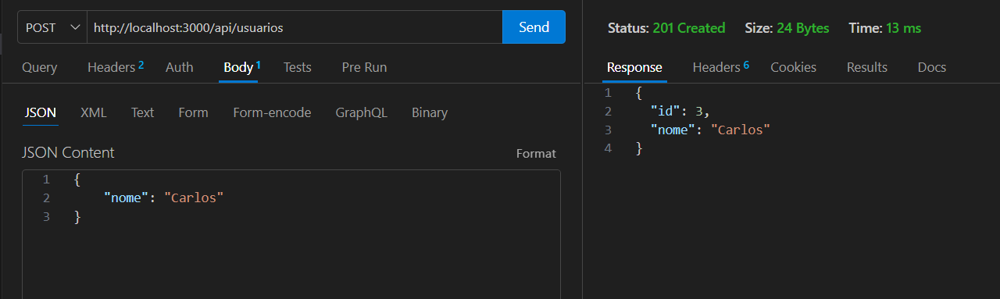
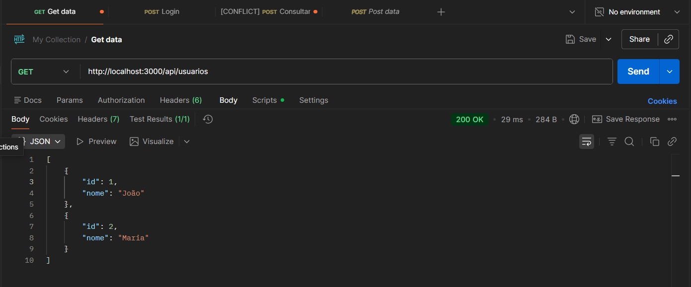
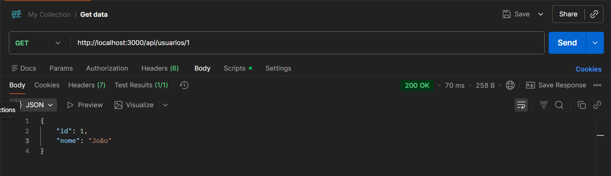
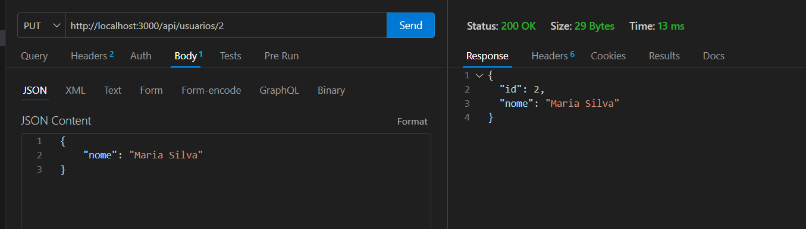
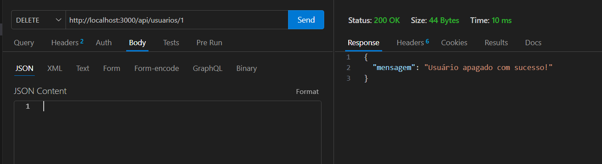

# 📚 API de Gerenciamento de Usuários

Projeto desenvolvido para a disciplina de Desenvolvimento de Aplicativos moveis. É uma API RESTful básica em Node.js e Express, com operações de CRUD e banco de dados em memória.

## 🚀 Como rodar o projeto

1. Clone o repositório.
2. Instale as dependências: `npm install express`
3. Inicie o servidor: `node index.js` (ou o nome do seu arquivo principal).
4. O servidor estará rodando em `http://localhost:3000`.

---

## 🛡️ Validações Implementadas

* **Validação de Existência (404 Not Found):** As rotas de busca por ID (`GET`), atualização (`PUT`) e exclusão (`DELETE`) verificam se o ID informado existe na lista. Caso não exista, a operação é bloqueada e um erro amigável é retornado ao cliente.

---

## 📡 Endpoints e Testes no Postman

Abaixo estão detalhados todos os endpoints da API, junto com as capturas de tela dos testes realizados. Foram criados mais de 5 recursos via POST, conforme solicitado.

### 1. Rota de Teste (GET)
* **URL:** `/api/teste`
* **Descrição:** Verifica se a API está online.
* **Teste no Postman:**

### 2. Criar Novo Usuário (POST)
* **URL:** `/api/usuarios`
* **Body (JSON):** `{ "nome": "Carlos" }`
* **Descrição:** Cria um novo usuário e gera um ID automaticamente.
* **Teste no Postman:**

### 3. Listar Todos os Usuários (GET)
* **URL:** `/api/usuarios`
* **Descrição:** Retorna a lista completa de usuários cadastrados (incluindo os 5 criados via POST).
* **Teste no Postman:**

### 4. Buscar Usuário por ID (GET)
* **URL:** `/api/usuarios/1`
* **Descrição:** Retorna os dados de um usuário específico baseado no ID da URL.
* **Teste no Postman:**

### 5. Atualizar Usuário Existente (PUT)
* **URL:** `/api/usuarios/2`
* **Body (JSON):** `{ "nome": "Maria Silva" }`
* **Descrição:** Atualiza o nome de um usuário existente pelo ID.
* **Teste no Postman:**

### 6. Apagar um Usuário (DELETE)
* **URL:** `/api/usuarios/1`
* **Descrição:** Remove um usuário do banco de dados em memória.
* **Teste no Postman:**

